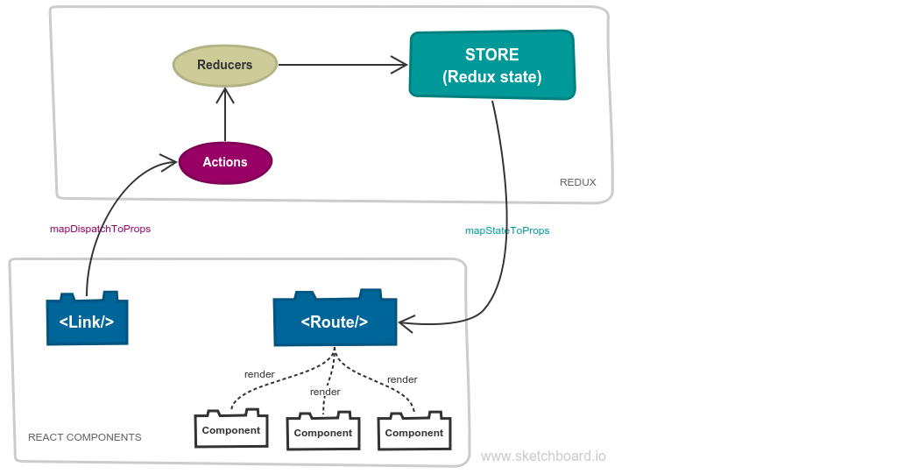

# React-Pretence-Router [](https://www.npmjs.com/package/react-pretence-router)


This router is based on [React-Redux](https://redux.js.org/basics/usagewithreact) and use `state` in [Redux `store`](https://redux.js.org/basics/store) to decide which component will be rendered. It look like a router but it isn't a real router like [React-Router](https://github.com/ReactTraining/react-router).

It is lightweight, very simple to use and useful for small application or web browser extension development (Google Chrome or Firefox). Simple solution for simple requirement (^_~).

I recommend you to use [Redux DevTools](https://github.com/zalmoxisus/redux-devtools-extension) to know more about what happen and how data changed when you develop your app.

Tested on:
* Windows 10 (version 1803)
* MacOS High Sierra (version 10.13)
* Debian 9

## Screenshot
* [Online demo on Codesandbox](https://codesandbox.io/s/r53y0kyvzo)
* This router used in my other project that is a Firefox extension - [gToDos](https://addons.mozilla.org/sv-SE/firefox/addon/gtodos/)


## Requirement
* React ([react](https://www.npmjs.com/package/react), [react-dom](https://www.npmjs.com/package/react-dom))
* Redux ([redux](https://www.npmjs.com/package/redux))
* React-Redux ([react-redux](https://www.npmjs.com/package/react-redux))
   * combineReducers()
   * `preloadedState` is an object (in file `./src/app.js`)
* Using include property in Webpack config for Babel loader (view file `./webpack.common.js`) and do not use exclude property.
````
include: [
    path.resolve(__dirname, "src"),
    path.resolve(__dirname, "node_modules/react-pretence-router")
]
````

## Using
* Add to your project by:
   * Install from npm by command: `npm i -D react-pretence-router`
   * Or copy this directory `./src/react-pretence-router` to your project directory and import components that you need to your code by `import {...} from ./react-pretence-router/` like normal components.
* Begin with file `./src/app.js` to know how you can start.
* View file `./src/menu.js` to know how you can create a link.

|Component|Input|Type|Description
|---|---|---|---|
|`<Route/>`|path|string|It must be the same with `to` in `<Link/>` component|
||component|React component||
|`<Link/>`|to|string|It must be the same with `path` in `<Route/>` component|
||name|string|Hyperlink display text|
||css|string|CSS class|
|`routerReducers as router`|-|-|Using for creating Redux store|

That's all and it's very simple. You can do it when you can React-Redux basic.

Don't worry about these things when you have Google ! (^_~)

## Clone
* Local web server started at: `htpp://localhost:9000`
* Commands:
    * `npm run start`: start Webpack Dev Server
    * `npm run build`: compile your app with production mode in Webpack into folder `./dist`
